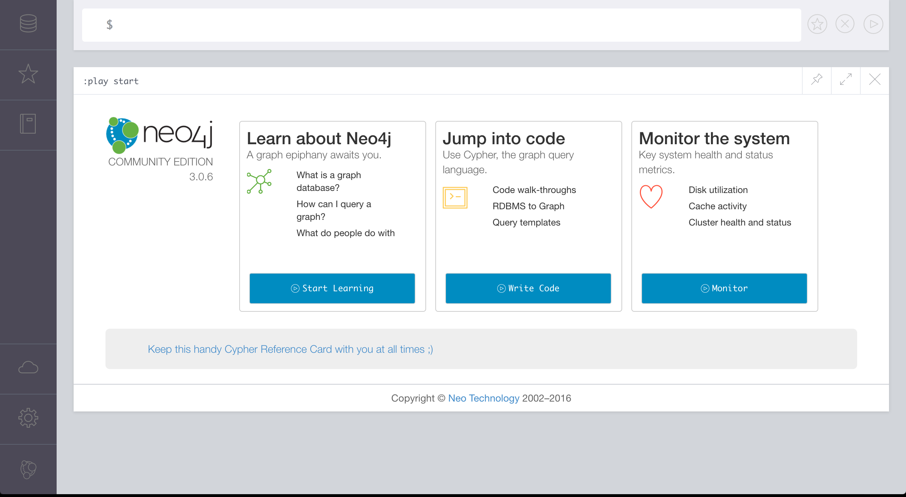

# Installing Neo4j on a Mac

In this section we will learn how to install and setup Neo4j on a Mac. If you are running a different OS, you can find a link to the documentation that explains how to install Neo4j on different platforms.

Before installing Neo4j, you need to make sure to have Java and Homebrew installed. You can follow this [link](http://www.oracle.com/technetwork/java/javase/downloads/index.html) to download and install Java. And if you don't have [Homebrew](http://brew.sh/) installed, you can go to the Homebrew site and copy paste the installation script in the terminal:

```bash
/usr/bin/ruby -e "$(curl -fsSL https://raw.githubusercontent.com/Homebrew/install/master/install)"
```

After you have Java installed, you can install Neo4j with `brew install neo4j`. After the installation process is finished, you can start the server with `neo4j start`. It will take about 5 seconds for the server to come up. When the server is up, you can go to your browser and navigate to `http://localhost:7474/browser/` to see the Neo4j interface. The default credentials to login is as follows:

```bash
username: neo4j
password: neo4j
```

If everything goes well, you should see an interface like the following:



When you start Neo4j, the server creates a folder that contains the full database. The path to the database, would be similar to the following:

```bash
/usr/local/Cellar/neo4j/3.0.6/libexec/data/databases
```

In this folder, you should see a folder called `graph.db` that is basically the database. If you remove the content of `graph.db`, you can basically refresh the database. You can also backup your database by zipping this folder.

## Reseting the Database

You can follow the following steps to reset your database. First, you need to find the path to your database. If you are on a Mac, the path would be similar to the following:

```bash
/usr/local/Cellar/neo4j/3.0.6/libexec/data/databases/graph.db
```

Once you have verified that the path is valid, first run the following to stop the server:

```bash
neo4j stop
```

Then run the following to remove all the content of the database:

```bash
rm -rf /usr/local/Cellar/neo4j/3.0.6/libexec/data/databases/graph.db/*
```

Then start the server again:

```bash
neo4j start
```


## Installing Neo4j on other Platforms

To learn more about the installation process, you can consult the [documentation](https://neo4j.com/docs/operations-manual/current/installation/) and learn how to install Neo4j on your platform.


